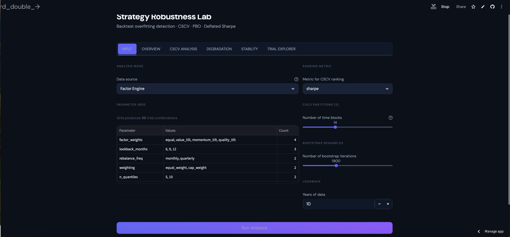

# Strategy Robustness Lab

A framework for detecting overfitting in backtested trading strategies, implementing the full Bailey, Borwein, Lopez de Prado & Zhu (2014) methodology.



---

## What It Does

When you backtest many strategy variations and pick the best, the winner's performance is biased upward — it may simply be the luckiest noise configuration. This tool answers: **"Is my best backtest actually robust, or just overfit?"**

It runs six diagnostic tests on any set of strategy variations:

| Diagnostic | What It Measures |
|------------|-----------------|
| **PBO** (Probability of Backtest Overfitting) | How often the in-sample best strategy underperforms out-of-sample |
| **CSCV** (Combinatorial Symmetric Cross-Validation) | Generates thousands of IS/OOS splits from time blocks to build a full PBO distribution |
| **Deflated Sharpe Ratio** | Whether the best Sharpe survives a multiple-testing correction |
| **Stochastic Dominance** | Whether the best strategy's OOS returns dominate a benchmark in distribution |
| **Parameter Stability** | Whether performance is robust across the parameter grid or fragile at one point |
| **Bootstrap Inference** | Confidence intervals on the Sharpe ratio via standard and block bootstrap |

The output is a **traffic light verdict**: ROBUST / LIKELY ROBUST / BORDERLINE / LIKELY OVERFIT / OVERFIT.

---

## Key Features

- **Built-in connectors** for Factor Engine (Project 3) and TSMOM Engine (Project 6) — sweeps parameter grids automatically
- **Generic CSV input** — test any pre-computed trial matrix for overfitting
- **Synthetic demo mode** — generates noise strategies with planted signal for validation
- **136 unit tests** covering all formulas, edge cases, and the full pipeline
- **Bloomberg dark mode dashboard** — 6-tab Streamlit app with Plotly charts
- **All thresholds configurable** via `config.yaml` — no hardcoded numbers

---

## Quick Start

### Install

```bash
git clone https://github.com/FrancoisRost1/strategy-robustness-lab.git
cd strategy-robustness-lab
pip install -r requirements.txt
```

### Run the Pipeline (CLI)

```bash
# Default: TSMOM connector
python3 main.py

# Factor Engine connector
python3 main.py --connector factor

# Synthetic demo (fast, for testing)
python3 main.py --mode synthetic

# CSV input
python3 main.py --connector csv --config config.yaml
```

### Run the Dashboard

```bash
python3 -m streamlit run app/app.py
```

### Run Tests

```bash
python3 -m pytest tests/ -v
```

---

## Methodology

**Combinatorial Symmetric Cross-Validation (CSCV)** splits the time series into S contiguous blocks (default 16), then generates all C(S, S/2) = 12,870 symmetric IS/OOS partitions. For each partition, it ranks every strategy variation on the IS half, identifies the IS-best, and records that strategy's OOS rank.

**Probability of Backtest Overfitting (PBO)** is the fraction of these combinations where the IS-best strategy ranks in the bottom half OOS. A PBO near 0 means the best backtest consistently performs well out-of-sample. A PBO above 0.5 means it's more likely to underperform than outperform — a strong overfitting signal.

**Deflated Sharpe Ratio** adjusts the best Sharpe ratio for the number of strategies tested (data snooping bias), return skewness, and kurtosis. A DSR below 0.95 means the observed Sharpe is not statistically significant after accounting for multiple testing.

**Reference:** Bailey, Borwein, Lopez de Prado & Zhu (2014) — *"The Probability of Backtest Overfitting"*

---

## Project Structure

```
strategy-robustness-lab/
├── main.py                          # CLI entry point — argparse + dispatch
├── config.yaml                      # All parameters and thresholds
├── requirements.txt
├── README.md
├── CLAUDE.md                        # Full project specification
├── .streamlit/config.toml           # Bloomberg dark theme
├── src/
│   ├── pipeline.py                  # Full analysis pipeline orchestration
│   ├── cscv.py                      # CSCV partition + combination generation
│   ├── pbo.py                       # PBO computation (logit model)
│   ├── metrics.py                   # Sharpe, Sortino, Calmar, CAGR, MaxDD
│   ├── degradation.py               # IS→OOS degradation analysis
│   ├── deflated_sharpe.py           # Deflated Sharpe Ratio (Bailey & LdP 2014)
│   ├── stochastic_dominance.py      # KS test + 2nd-order SD
│   ├── bootstrap.py                 # Standard + block bootstrap
│   ├── parameter_stability.py       # Heatmaps, sensitivity, plateau detection
│   ├── verdict.py                   # Traffic light classification
│   ├── grid_engine.py               # Parameter grid generation
│   ├── data_loader.py               # yfinance fetch + CSV + caching
│   ├── connectors/
│   │   ├── factor_connector.py      # Factor engine trial matrix generator
│   │   ├── tsmom_connector.py       # TSMOM trial matrix generator
│   │   └── csv_connector.py         # External CSV loader
│   └── utils/
│       └── config_loader.py         # YAML config loader
├── app/
│   ├── app.py                       # Streamlit entry point
│   ├── style_inject.py              # Bloomberg dark mode design system
│   ├── tab_input.py                 # Tab 1 — Strategy Input
│   ├── tab_overview.py              # Tab 2 — Verdict & KPIs
│   ├── tab_cscv.py                  # Tab 3 — CSCV Analysis
│   ├── tab_degradation.py           # Tab 4 — Degradation & Bootstrap
│   ├── tab_stability.py             # Tab 5 — Parameter Stability
│   └── tab_explorer.py              # Tab 6 — Trial Explorer
├── tests/                           # 136 tests across 12 test files
├── docs/
│   └── analysis.md                  # Investment write-up
└── data/
    ├── raw/
    ├── processed/
    └── cache/
```

---

## Configuration

All parameters live in `config.yaml`. Key settings:

| Section | Parameter | Default | Description |
|---------|-----------|---------|-------------|
| `cscv` | `n_partitions` | 16 | Number of time blocks S. C(16,8) = 12,870 combinations |
| `ranking` | `metric` | sharpe | Ranking metric: sharpe, sortino, or calmar |
| `pbo` | `green_threshold` | 0.25 | PBO below this = GREEN |
| `pbo` | `yellow_threshold` | 0.50 | PBO below this = YELLOW, above = RED |
| `deflated_sharpe` | `significance_level` | 0.95 | DSR must exceed this |
| `bootstrap` | `n_resamples` | 1000 | Bootstrap iterations |
| `bootstrap` | `block_size` | 21 | Block bootstrap block size (trading days) |
| `parameter_stability` | `plateau_tolerance` | 0.10 | Within 10% of best = plateau |

---

## Tech Stack

- **Python 3.9+**
- **pandas / numpy** — data manipulation
- **scipy** — KS test, statistical functions
- **yfinance** — market data
- **streamlit** — dashboard
- **plotly** — interactive charts
- **pytest** — 136 tests

---

## Finance Portfolio Series

This is **Project 7 of 11** in a comprehensive finance engineering portfolio:

| # | Project | Status |
|---|---------|--------|
| 1 | [LBO Engine](https://github.com/FrancoisRost1/lbo-engine-version1) | Complete |
| 2 | [PE Target Screener](https://github.com/FrancoisRost1/pe-target-screener) | Complete |
| 3 | [Factor Backtest Engine](https://github.com/FrancoisRost1/factor-backtest-engine) | Complete |
| 4 | [M&A Database](https://github.com/FrancoisRost1/ma-database) | Complete |
| 5 | [Volatility Regime Engine](https://github.com/FrancoisRost1/volatility-regime-engine) | Complete |
| 6 | [TSMOM Engine](https://github.com/FrancoisRost1/tsmom-engine) | Complete |
| 7 | **Strategy Robustness Lab** | **This project** |
| 8 | Portfolio Optimization Engine | Planned |
| 9 | Options Pricing Engine | Planned |
| 10 | AI Research Agent | Planned |
| 11 | Mini Bloomberg Terminal | Planned |

**GitHub:** [github.com/FrancoisRost1](https://github.com/FrancoisRost1)
